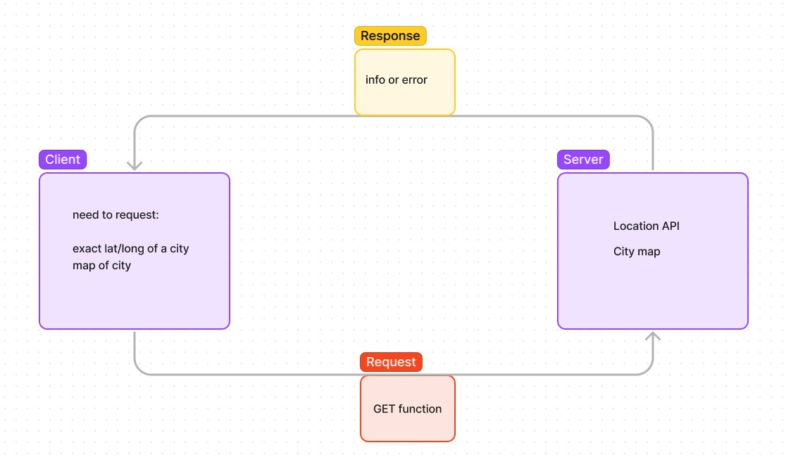
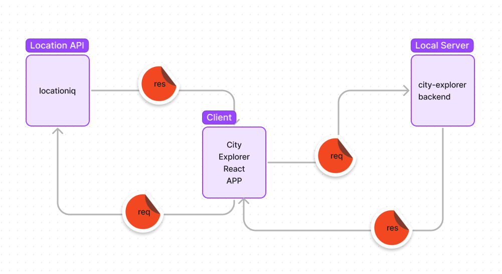
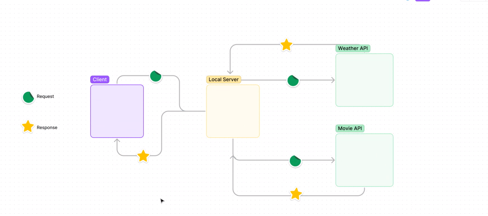
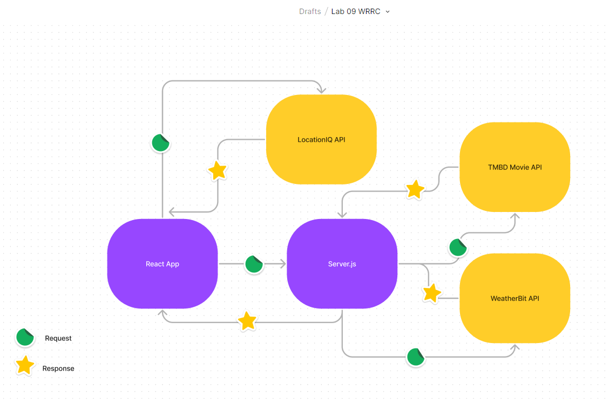

# City Explorer

**Author**: Mandy Mason
**Version**: 1.4.0 (increment the patch/fix version number if you make more commits past your first submission)

## Overview
An app that allows the user to view a map and the latitute & longitude by searching for a city.

## Getting Started
<!-- What are the steps that a user must take in order to build this app on their own machine and get it running? -->

## Architecture
JavaScript, React, Node.js, 

## Change Log
Initial setup: 7/18/2022
Location and Map data: 7/19/2022
Weather from data.json: 7/20/2022
Live Weather and Movie info: 7/21/2022
### Lab 06

### Whiteboard of WRRC 
Collab with Erin Ranta, TJ Parker

**Name of feature: Locations**

Estimate of time needed to complete: 1 hour

Start time: 8:30pm

Finish time: 11:00pm

Actual time needed to complete:2.5 hours

**Name of feature: Map**

Estimate of time needed to complete: 1 hour

Start time: 11:20pm

Finish time: 12:30am

Actual time needed to complete: 1 hour 10 minutes

**Name of feature: Errors**

Estimate of time needed to complete: 1 hour

Start time: 12:45am

Finish time: 

Actual time needed to complete: 

## Lab 07

### Lab 7 Whiteboard WRRC
Collab with Anthony Johnson

## Features

**Name of feature: #1 - Initial Setup** 

Estimate of time needed to complete: 30 minutes

Start time: 9:25pm

Finish time: 9:55pm

Actual time needed to complete: 25 minutes

**Name of feature: #2 - Weather** 

Estimate of time needed to complete: 2.5 hours

Start time: 10:00pm (paused @ 12:30am - incomplete / resume 3:30pm following day)

Finish time: 7:30pm (next day)

Actual time needed to complete: 5 hours

## Lab 08

### Lab 8 Whiteboard WRRC
Collab with Caelin Hargrave

## Features

**Name of feature: #1 - Weather (live)** 

Estimate of time needed to complete: 2 hours

Start time: 11:00pm

Finish time: 9:00pm (following day)

Actual time needed to complete: 4.5 hours

**Name of feature: #2 - Movie Data** 

Estimate of time needed to complete: 2 hours

Start time: 9:30pm

Finish time: 1:00am

Actual time needed to complete: 3.5 hours

### Lab 9 Whiteboard WRRC
Collab with Austin Limanek

## Features

**Name of feature: #1 - Componentize** 

Estimate of time needed to complete: 1 hour

Start time: 11:40am

Finish time: 12:10pm

Actual time needed to complete: 30 minutes

## Credit and Collaborations

Jacob Knaack  - demo code
Charlie Fadness - help with API key
Ben Mills - help with local server
Kassie Bradshaw & Tammy Do - help connecting APIs to server

